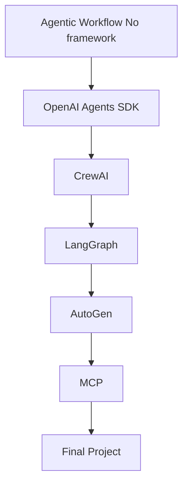

# 🤖 Master AI Agents in 30 Days


> A hands-on journey building real-world AI Agents using modern frameworks like OpenAI Agents SDK, CrewAI, LangGraph, AutoGen, and MCP.

---

## 🚀 Overview

This repository contains **8 production-style AI Agent projects** built over 30 days while learning and applying:

- OpenAI Agents SDK
- CrewAI
- LangGraph
- AutoGen
- MCP

Each project focuses on solving real-world problems using agentic workflows, tool use, memory, and multi-agent collaboration.

---

## 📊 Learning Progress



---

## 📚 Course Structure

| Section | Framework | Status |
|----------|-----------|--------|
| 01 | Agentic Workflow No framework | 🟢 Completed |
| 02 | OpenAI Agents SDK | 🟡 In Progress |
| 03 | CrewAI | ⏳ Upcoming |
| 04 | LangGraph | ⏳ Upcoming |
| 05 | AutoGen | ⏳ Upcoming |
| 06 | MCP | ⏳ Upcoming |
| 07 | Final Project | ⏳ Upcoming |

---

## 🛠 Projects Included

- AI Evaluator Agent
- Self-improving Agent
- Multi-Agent Crew System
- LangGraph Planner Agent
- AutoGen Collaboration Agent
- MCP Tool-using Agent
- Final End-to-End Agent System

---

## 📂 Repository Structure

```
section-01-Agentic Workflow No framework/
section-02-openai-agents-sdk/
section-03-crewai/
section-04-langgraph/
section-05-autogen/
section-06-mcp/
section-07-final-project/
```

---

## 🎯 Goal

To build a strong **AI Agents portfolio** that demonstrates:

- Real-world engineering skills
- System design thinking
- Multi-agent orchestration
- Production-ready Python code

---

## ⚡ Tech Stack

- Python
- OpenAI
- CrewAI
- LangGraph
- AutoGen
- MCP
- Ollama (local LLMs)

---

## 📌 Status

🚧 Actively building during the 30-day learning journey.

---

## ⭐ About This Project

This repository demonstrates my journey in building production-grade AI Agents systems.

It reflects:
- System design thinking
- Agent orchestration skills
- Practical AI engineering experience

🚀 Open for collaboration and opportunities in AI Engineering / Data Engineering.
